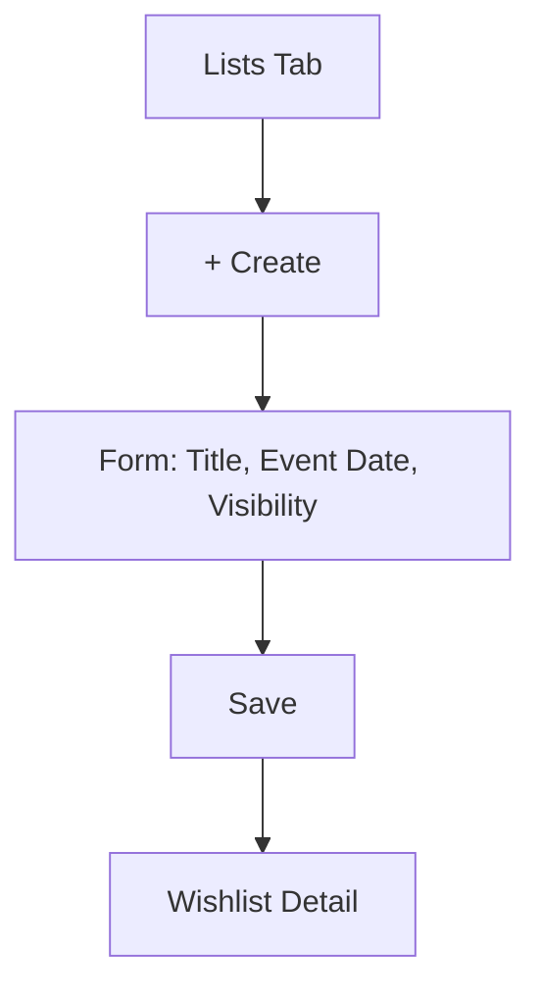
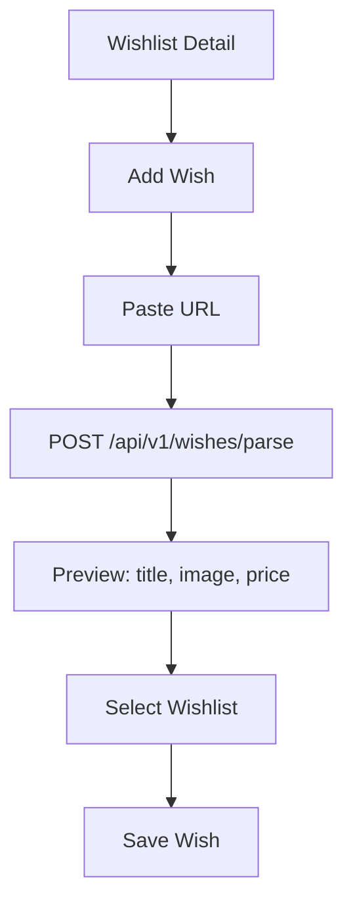
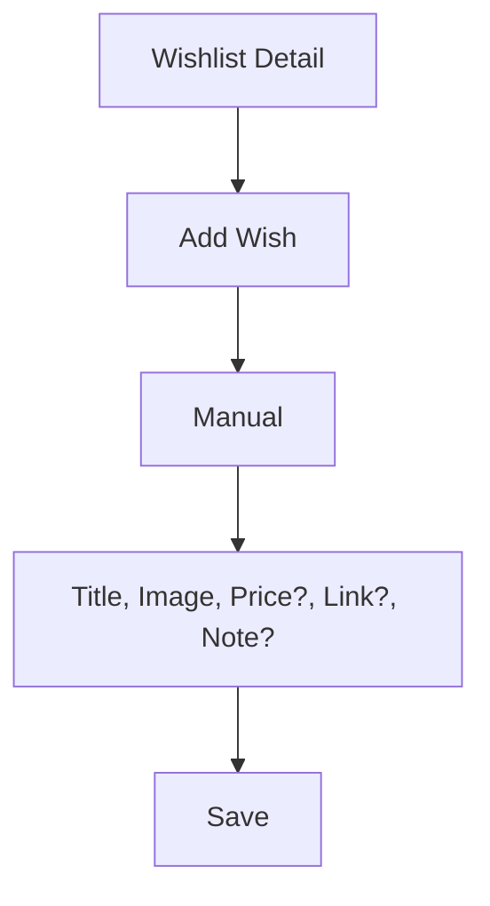
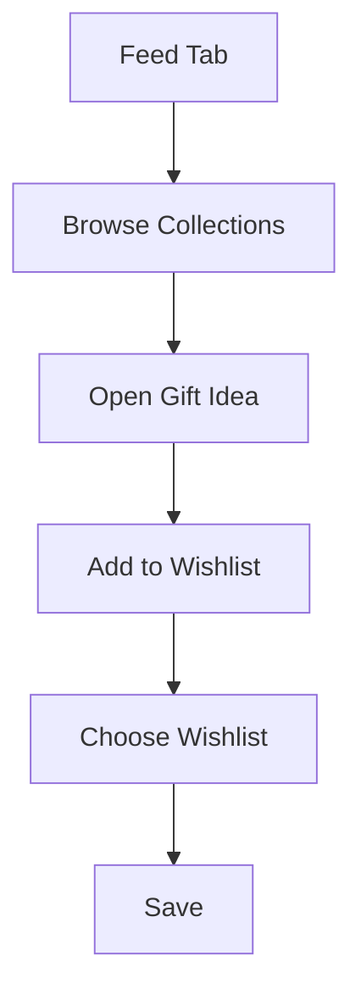
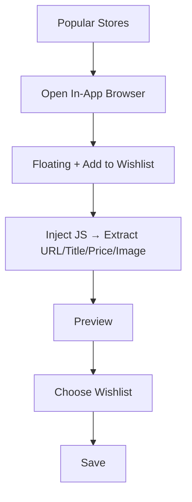

# UI/UX Design System — WishApp (MVP)

Date: 2025-11-12
Owner: Design Lead / Mobile Lead
Sources: `PRD_WishApp.md`, `AppMap_WishApp.md`, `Docs/Implementation.md`, `Docs/project_structure.md`

---

## Design Principles
- **Minimalism first**: Pinterest-like grid, focus on imagery and clean typography.
- **Clarity**: Few steps, obvious actions, progressive disclosure.
- **Delight**: Subtle microinteractions, smooth transitions, responsive feedback.
- **Consistency**: Shared tokens, components, and patterns across iOS/Android/Web.
- **Accessibility**: WCAG 2.1 AA color contrast, dynamic text scaling, semantics.

---

## Branding & Style Guide

### Color Tokens (Material 3 theme)
- `color.primary`: Brand accent (pastel, warm) — e.g., `#FF7A59` (sample; finalize in design).
- `color.onPrimary`: `#FFFFFF`
- `color.secondary`: Muted accent — e.g., `#7A8C99`
- `color.neutral.0-100`: Grays for backgrounds, borders, text (e.g., `#0B0D0F` .. `#FAFBFC`).
- `color.success`: `#22C55E`
- `color.warning`: `#F59E0B`
- `color.error`: `#EF4444`
- Light/Dark themes required; auto-switch by OS with user override.

### Typography
- Material 3 defaults; adjust scale to platform:
  - Display, Headline, Title, Body, Label.
  - Min body size 15–16px on web for readability.
  - Support dynamic type scaling (Flutter `MediaQuery.textScaler`).

### Spacing & Radius
- Spacing scale: 4, 8, 12, 16, 20, 24, 32.
- Radius scale: 8 (cards), 12 (modals), 999 (pills).
- Shadows: soft, low elevation; avoid heavy drop shadows.

### Iconography & Imagery
- Icons: Material Symbols; consistent stroke weight.
- Imagery: Product photos dominate cards; preserve aspect ratio; use placeholders/skeletons.

---

## Component Library (Flutter)
Directory alignment: `app/lib/core/widgets/` for shared components, feature-specific under `app/lib/features/*/presentation`.

- **AppBar**: Title, optional actions (Share, Add). Collapsible on scroll.
- **TabBar / BottomNav**: 4 tabs → Lists, Feed, Add, Profile.
- **Buttons**: Primary, Secondary, Tertiary (text), Destructive; sizes: L/M/S; loading state.
- **Inputs**: TextField, PriceField, URLField; validation with clear error text.
- **Cards**:
  - `WishlistCard`: Title, date/event, unclaimed count.
  - `WishCard`: Image, title, price, status badge (Available/Claimed); claim CTA for guests.
  - `CollectionCard` (Feed): cover image, title, tag.
- **Chips**: Category chips, filter chips.
- **Modals/Sheets**:
  - Add Wish (manual / preview from parse)
  - Choose Wishlist
  - Donate (Stage 3)
- **Toasts/Snackbars**: Success, error, info.
- **Empty/Loading**: Skeleton loaders; “Create your first list” empty state.

States to cover: hover (web), pressed, focused, disabled, loading.

---

## Layout & Responsive Rules

### Breakpoints (reference)
- `xs`: ≤360
- `sm`: 361–480
- `md`: 481–768 (phones landscape / small tablets)
- `lg`: 769–1024 (tablets)
- `xl`: ≥1025 (web)

### Grid & Cards per row
- Lists: `xs:2`, `sm:2-3`, `md:3`, `lg:3-4`, `xl:4-5`
- Feed: hero spans 2 cols on `md+`; collections in 2–4 cols depending on width.
- Wish detail: 1-col on mobile, 2-col layout on `lg+` (gallery | details).

### Hit Areas & Touch
- Minimum touch target 44x44px. Maintain 16px padding inside touchables.

### Web specifics
- Max content width 1200px, centered; generous whitespace; sticky header.

---

## Accessibility
- Contrast: AA or better; test primary on backgrounds in both themes.
- Text scaling: support up to 1.3–1.5x without layout breakage.
- Semantics: meaningful labels on interactive elements; `Semantics` widgets for key controls.
- Focus order & indicators: visible focus ring on web; logical traversal.
- Motion sensitivity: respect OS reduce motion settings (minimize animations).

---

## Motion & Microinteractions
- Durations: 150–240ms for standard transitions; 300ms for modal/route transitions.
- Easing: `standard`, `decelerate` for entrances, `accelerate` for exits.
- Feedback: button press ripples; list refresh pull animation; “claim” success confetti micro (subtle).
- Hero animations: image → wish detail.

---

## Key UX Flows

### Onboarding & Auth
```mermaid
flowchart TD
  A[Launch App] --> B{Deep link?}
  B -- No --> C[Welcome]
  B -- Yes --> D[Open Shared List]
  C --> E[Choose Auth]
  E -->|Email| F[Sign-in/Up]
  D --> G[Lite Mode Auto-Provision guest_{uuid}]
  G --> H[Wishlist Detail as Guest]
```

### Create Wishlist


### Add Wish — Paste URL → Parse


### Add Wish — Manual Entry


### Claim System (Guest Lite Mode)
- Owner cannot claim their own items.
- Surprise mode: owner sees “claimed” only; identity hidden.

```mermaid
flowchart TD
  A[Public/List Link] --> B[Wishlist Detail]
  B --> C[Guest taps Claim]
  C --> D{Has account?}
  D -- No --> E[Auto-create guest_{uuid}]
  D -- Yes --> F[Use existing auth]
  E --> G[Wish.status = claimed_by:guest]
  F --> G
  G --> H[Guest sees: You're gifting this]
  G --> I[Owner sees: Someone claimed]
```

### Ideas Feed → Add to List


### In-App Browser Auto-Parse (Stage 3)


---

## Copy & Content Guidelines
- Keep CTAs short: “Add Wish”, “Claim”, “Share”, “Donate”.
- Error text: human, actionable (“Please paste a valid URL”).
- Empty states: single-sentence guidance + primary action.

---

## Component Library Organization
- `app/lib/core/widgets/`: shared buttons, inputs, cards, modals, loaders.
- `app/lib/core/theme/`: tokens, themes, elevations.
- Feature-level UI under `app/lib/features/*/presentation` (e.g., `wishlists`, `wishes`, `feed`).

---

## Responsive & Adaptive Assets
- Provide 1x/2x/3x assets for mobile; web assets optimized & cached via CDN.
- Use `cached_network_image` with placeholders and error fallbacks.

---

## Accessibility Checklist (per screen)
- [ ] Labels and hints on all actionable controls.
- [ ] Contrast verified for primary/secondary buttons.
- [ ] Focus order matches visual order.
- [ ] Supports text zoom to 130–150% without clipping.
- [ ] Touch targets ≥44px.

---

## Wireframes & References
- Wireframes to be hosted in Figma with pages:
  - 01_Onboarding
  - 02_Lists
  - 03_Wishlist_Detail
  - 04_Add_Wish
  - 05_Wish_Detail
  - 06_Feed
  - 07_InApp_Browser (Stage 3)
- Export PNGs to `Docs/wireframes/` when finalized.

---

## Design Tool Integration
- Figma library with styles (colors, text, effects) and components (buttons, inputs, cards).
- Tokens export (optional) to Flutter via codegen or manual mapping in `app/lib/core/theme/`.
- Versioning changes noted in `CHANGELOG.md` (Design section) aligned to releases.

---

## Cross-References
- Align endpoints and flows with `Docs/Implementation.md` (API naming, SSR pages).
- Match folder/component naming with `Docs/project_structure.md`.
- Observe parser scope and privacy/claim rules from `PRD_WishApp.md` and `AppMap_WishApp.md`.

---

## Notes
- Owner cannot claim their own wishes; guests can claim/donate; surprise mode hides identity from owner.
- Public SEO page available at `/p/:slug`; share links readable by anonymous visitors.
- Parser: OG image required; title/price best effort; gallery later.
